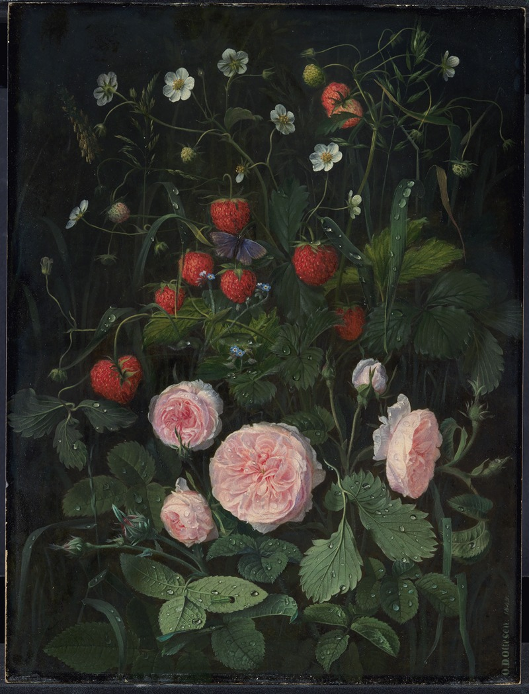

# This is a test of the emergency Summer gothcasting system. 

There's been something unique about this summer.

Maybe it's a yearning for Autumn, maybe it's the thoughts of strawberries and of Strawberry Hill House. It feels gothic: enduring the long, humid summer days and finding solace in cooler nights. Day becomes a time for protection and rest, the darkness an invitation to enjoy the world. 

I've decided to lean into these feelings and have begun reading gothic and vampire-themed books, as well as watching a few vampire films. If you'd like to join in: 

* [Vampire Summer Reading List](https://app.thestorygraph.com/tags/419c4482-4a31-429d-bf3f-521e1b134ada?redirect=true)
* [Vampire Summer Films](https://letterboxd.com/gothintheshell/list/vampire-summer/)

